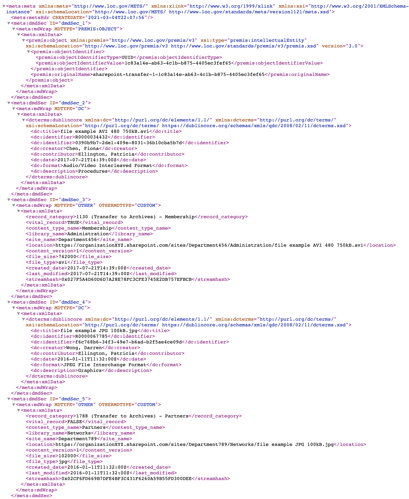
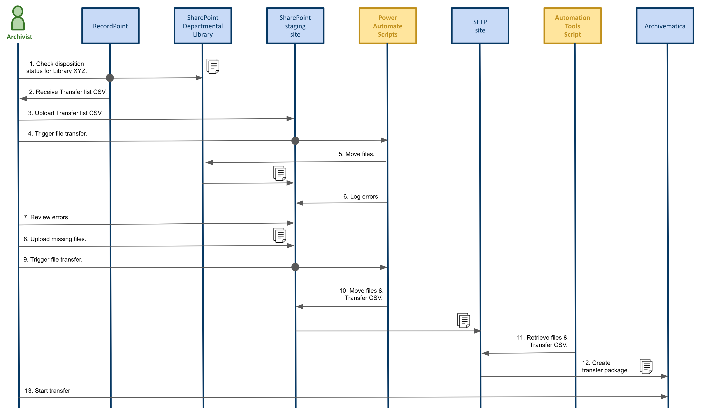

# RecordPoint-to-Archivematica (RP-2-AM)
Convert RecordPoint [Records365](https://www.recordpoint.com/records365/) metadata and [MS-SharePoint](https://www.microsoft.com/en-us/microsoft-365/sharepoint/collaboration) file exports to [Archivematica-ready](https://www.archivematica.org/en/docs/archivematica-1.12/user-manual/transfer/transfer/#transfers-with-metadata) transfers.

* [Overview](#overview)
* [Usage](#usage)

---

## Overview
This repository contains scripts and anonymized sample data from an Artefactual Systems client project to create a Proof-of-Concept workflow that integrates RecordPoint/SharePoint disposition export with Archivematica transfer ingest.

RecordPoint allows for the export of a maximum of 20 metadata fields to a CSV file. Using [Power Automate](https://flow.microsoft.com/en-us/) scripting, this CSV file is used to trigger a disposition workflow in a SharePoint library which exports its scheduled files, along with the CSV file, to a Secure FTP (SFTP) site. The current timestamp is used as the folder name for the export, see for example [`/data/sharepoint-exports/2021-03-02_10-24`](https://github.com/artefactual-labs/RP-2-AM/tree/main/data/sharepoint-exports/2021-03-02_10-24). 

Archivematica then runs a script to retrieve these files and convert the export folder and CSV data into transfer packages that can be ingested into Archivematica. See [`/data/archivematica-transfers`](https://github.com/artefactual-labs/RP-2-AM/tree/main/data/archivematica-transfers).

Once the transfer has been processed by Archivematica it produces an Archival Information Package (AIP). This contains the RecordPoint metadata in its METS XML file, the original files, and any preservation copies of the files, if applicable as per the Archivematica installation's Format Policy Registry (FPR) rules. See [`/data/archivematica-aips/sharepoint-transfer-1-1c83a14e-ab63-4c1b-b875-4405ec3fef65`](https://github.com/artefactual-labs/RP-2-AM/tree/main/data/archivematica-aips/sharepoint-transfer-1-1c83a14e-ab63-4c1b-b875-4405ec3fef65).

The following table shows those RecordPoint CSV fields that are matched to a Dublin Core field in the Archivematica AIP METS file. The remaining fields are retained in the METS file's "OTHER" descriptive metadata (DMD) section.

| RecordPoint field   | Description         | Dublin Core element | Example |
| ------------------- |---------------------| --------------------| ------- |
| ItemNumber | identifier generated by RecordPoint | Identifier | R0000053476 |
| RecordCategory| retention series | | 1090 (Transfer to Archives) - Human Resources |
| VitalRecord| whether the record is critical to business continuity | | TRUE |
| Location| full network path | | https:// organizationXYZ.sharepoint.com/sites/Department123/Human_Resources/file example XLS 100.xls |
| Format| the type of file produced by software | Format | Microsoft Excel |
| ContentVersion| the number of revisions made to the file | | 2 |
| Author| creator of the file | Creator | Lévêque, François | 
| ContentTypeName| used to determine retention period | | Human Resources |
| Created_x0020_Date| file creation date |  | 2018-02-27T13:18:00Z |
| Editor| last person to have made changes to the file | Contributor | Earle, Patricia |
| File_x0020_Size| file size in bytes | | 20000 |
| File_x0020_Type| file extension | | xls
| Last_x0020_Modified| date the file was last modified | | 2018-04-11T11:08:00Z |
| LibraryName| SharePoint library name | | Human_Resources |
| SiteName| SharePoint site name | | Department123 |
| StreamHash| Microsoft-specific hash value | | 0x02C91E257671B45A08F343AA3A1C115A0EF12EBAF2 |
| UniqueId | the file's universally unique identifier | Identifier | ef1eac74-9ecf-4f33-b795-19258bcd139a |
| DocumentType| the file's purpose | Description | Budget |
| TrueDocumentDate| last modified or pre-SharePoint creation date, whichever is applicable | Date | 2018-04-11T11:08:00Z | 
| Title | filename assigned by author | Title | file example XLS 100.xls |

Below is a snippet showing the AIP METS file that was produced by running the rp-2-am.py script on the sample RecordPoint metadata and SharePoint export in this repository. You can also see the full METS XML file [here](https://github.com/artefactual-labs/RP-2-AM/blob/main/data/archivematica-aips/sharepoint-transfer-1-1c83a14e-ab63-4c1b-b875-4405ec3fef65/data/METS.1c83a14e-ab63-4c1b-b875-4405ec3fef65.xml).

NOTE: The sample files used in the [`/data/sharepoint-exports/2021-03-02_10-24`](https://github.com/artefactual-labs/RP-2-AM/tree/main/data/sharepoint-exports/2021-03-02_10-24) directory are sourced from https://file-examples.com/. They are not published with a license but "All files are free to download and use."

---

## Usage

### Power Automate script and SharePoint integration

The Power Automate scripts were developed by the IT staff of Artefactual's client for this Proof of Concept project. With their permission we hope to provide access to these scripts here in this repository under an Apache 2.0 license.

The following sequence diagram illustrates how the Power Automate scripts are used to trigger the disposition of SharePoint files to a SFTP transfer site, starting with identifying the files ready for transfer via the RecordPoint tool.

### RP-2-AM script and Automation Tools integration
Archivematica [Automation Tools](https://github.com/artefactual/automation-tools) is a set of Python scripts that are designed to automate the processing of transfers in an Archivematica pipeline. This project adds the [rp-2-am.py](https://github.com/artefactual-labs/RP-2-AM/blob/main/rp-2-am.py) script to this set to automate the conversion of RecordPoint/SharePoint exports to Archivematica-ready transfers.

The script can also be run in stand-alone mode. Provide the relative path of the SharePoint export directory as a parameter. For example: `python rm-2-am.py data/sharepoint-exports/2021-03-02_10-24`. The Archivematica-ready transfer package will be created in the `data/archivematica-transfers` directory.
